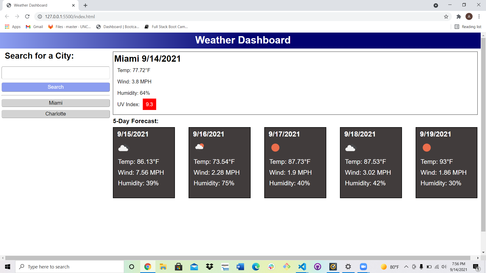

# Weather Dashboard

## About

This application allows the user to search for a city to find its current weather and the forecast for the next five days. After the search, the city name is saved into a button in a search history section. From here, the user may either conduct a search for a new city and the new city will be added to the search history, or the user may select one of the buttons from past searches to render its respective information.

## Screenshot

The following image shows the web application's appearance and functionality:

## Link to working application:

https://alexbrandon3.github.io/weather-dashboard/

